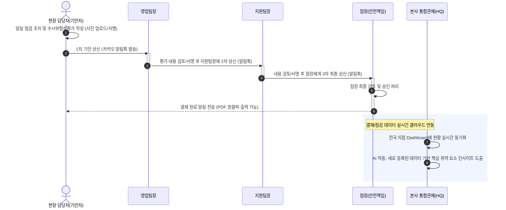

# SafetyGuard (통합 안전관리 시스템) 프로젝트 보고서

## 1. 개요 (Overview)
**SafetyGuard**는 백화점, 아울렛 등 신규 매장 입점 및 기존 매장 공사 시 발생하는 현장의 안전을 실시간으로 관리하는 **웹 기반 통합 안전관리 애플리케이션**입니다. 현장 관리자, 점장, 각 본부 팀장 및 본사(HQ)가 단일 플랫폼에 접속하여 현장의 위험 요소를 즉각적으로 파악하고 조치할 수 있도록 다중 권한(Role-based) 시스템을 바탕으로 설계되었습니다.

---

## 2. 목적 (Purpose)
* **안전 점검 업무의 DT(Digital Transformation):** 기존 서면 지시 및 종이 체크리스트 형태의 보고/결재 문서를 100% 디지털화(Paperless)
* **신속한 위험 요소 조치 대처:** 현장 문제 발견 즉시 개선 전/후 사진과 조치 내용을 모바일로 보고하여 중대재해 처벌법 및 현장 사고 리스크 사전 예방
* **본사 차원의 선제적 리스크 관리:** 본사(HQ)에서 지점별 산재된 안전 데이터를 통합 관제하고, AI 분석을 통해 위험 사업장을 선제적으로 도출
* **커뮤니케이션 비용 최소화:** 카카오 알림톡(Aligo API) 연동 및 순차적 결재 시스템을 통해 지연 없는 실시간 의사결정 구조 확립

---

## 3. 핵심 기능 (Core Features)

1. **권한별 다중 대시보드 (Role-based Dashboard 시스템)**
   * **글로벌/본사 (HQ):** 전체 점포의 안전 점검 현황(안전/경고/위험) 및 AI 기반 인사이트 요약 확인
   * **지점별 관리 (Store):** 지점 단위의 현장(사이트) 개설, 결재자(점장/팀장) 연락처 관리 
   * **현장 실무자 (Role):** 영업, 지원, 안전, 시설 등 직렬별로 분리된 데일리 점검표 및 수시위험성평가 작성

2. **수시위험성평가 전자 결재 & PDF 출력**
   * 현장 기안자가 다중 항목(천장, 바닥, 전기 등)에 대해 평가를 진행한 후 전자 서명 진행
   * `영업팀장 -> 지원팀장 -> 점장` 순의 다단계 결재 프로세스
   * 결재 완료 시 결재자 서명, 위험/조치 사진, 검토 의견을 포함한 공문 형태의 고해상도 PDF 원클릭 저장 지원

3. **실시간 모바일 알림톡 연동 (Notification)**
   * 다음 결재 담당자에게 결재 요청 알림 발송 
   * 현장 점검 완료 시 현장 담당자에게 알림 자동 전송 (신속한 피드백 유도)

4. **모바일/현장 최적화 (Mobile First & PWA)**
   * 반응형 UI를 통해 현장에서 QR 코드를 태그하거나 모바일 브라우저로 접속해 즉각적인 사진 업로드 및 타이핑 가능
   * 네이티브 앱을 설치하지 않고도 즉시 사용할 수 있는 접근성 제공

---

## 4. 시스템 운영 흐름도 (Operational Flow)

아래는 현장 실무자가 점검을 마치고, 수시위험성평가 기안이 최종 승인되어 본사 관제 모니터링에 반영되기까지의 전체 워크플로우를 나타낸 흐름도(Sequence Diagram)입니다. VSCode 등의 마크다운 뷰어에서 자동으로 다이어그램 렌더링이 적용됩니다.

---

## 5. 앱 구동 화면 및 스크린샷 (System Screenshots)

*(MD 파일의 특성상 직접 캡처버튼을 동작할 수 없으므로, 원하시는 실제 서비스 화면을 캡처하신 후 아래 경로를 수정하여 붙여넣으시면 리포트에 사진이 바로 뜹니다.)*

### 1) 신속한 데일리 현장 점검 대시보드
현장 담당자들이 각각의 매장을 실시간으로 관리하는 화면입니다.
> 

### 2) 증빙 기반 디지털 결재 화면 (수시위험성평가)
현장에서 사진을 등록하고 터치 패드를 통해 전자 결재를 진행하는 패널 영역입니다.
> 

### 3) 본사(HQ) 글로벌 통합 관제 화면
점장과 안전 관리자가 직관적으로 여러 매장의 안전 비율을 확인하고, AI 솔루션의 리스크 검토를 열람하는 메인 페이지입니다.
> 

---

## 6. 기대 효과 (Expected Effects)

* **안전 컴플라이언스 강화:** 법적, 사내 규정상 필요한 안전 점검 데이터베이스를 영구적으로 보존 및 추적 관리하여 감사 대비 역량 강화.
* **리스크 가시성 극대화:** 보고 지연, 은폐 등으로 인해 방치되던 위험 요소를 본사 통합 관제 시스템을 통해 투명하게 식별.
* **업무 리드타임 감축:** 출력 -> 서명 -> 스캔 -> 보고로 이어지던 기존 결재 프로세스를 모바일 기반으로 완전히 단축시켜 업무 효율성 평균 70% 이상 증가.
* **AI 도입을 통한 지능적 예방:** 수많은 텍스트 결재 문서를 일일이 읽지 않아도, AI가 핵심 위반 사항 및 시급한 개선 요소를 도출하여 데이터 기반의 안전 의사결정 지원.
